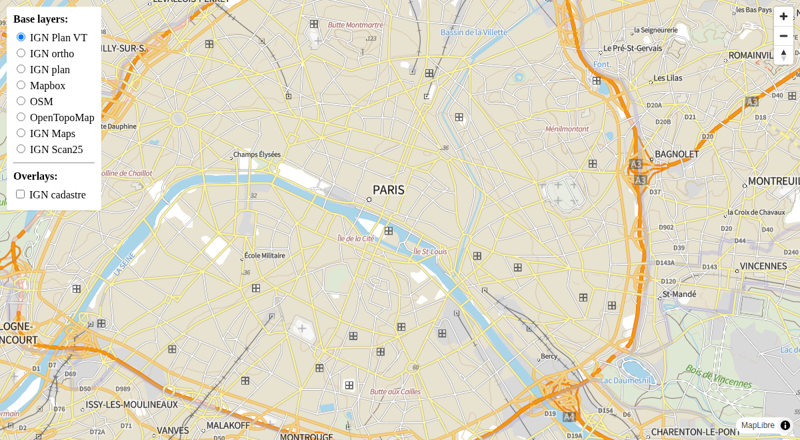

[](https://codecov.io/gh/makinacorpus/django-mapbox-baselayer)
[](https://github.com/makinacorpus/django-mapbox-baselayer/actions/workflows/python-ci.yml)

# Django Mapbox Baselayer

Django application to store, manage and serve map base layers and overlay configurations for **MapLibre GL JS** and **Mapbox GL JS**.

This package provides:
- Django models to store base layers and overlay layers configuration
- Admin interface to manage layers
- API endpoints to serve layer configurations as TileJSON
- Support for raster tiles, vector tiles, and Mapbox styles



# Getting started
### Installation
Install it in your project like any dependency
```bash
pip install django-mapbox-baselayer
```

### Usage
Declare django-mapbox-baselayer in the `INSTALLED_APPS`
```python
# settings.py

INSTALLED_APPS  = [
    # ... other django apps
    "mapbox_baselayer",
]
```

For Mapbox base layers, you do not need to describe the tiles with the `BaseLayerTile` object, but an url is mandatory.

For Raster base layers, is it necessary to create a `BaseLayerTile` for each url (`a.tiles.xxx`, `b.tiles.xxx`, etc ...)

Tile size should be 256 for raster and 512 for vector.

### Commands

#### Unified `install_layer` command

```bash
# OSM base layer
./manage.py install_layer osm
./manage.py install_layer osm --order 2

# OpenTopoMap base layer
./manage.py install_layer opentopomap
./manage.py install_layer opentopomap --order 3

# IGN base layers (list available layers)
./manage.py install_layer ign

# IGN base layers (install specific layers)
./manage.py install_layer ign ortho plan maps scan_25 cadastre plan_vt
./manage.py install_layer ign maps scan_25 --key my_api_key --order=1
./manage.py install_layer ign cadastre --overlay
```
